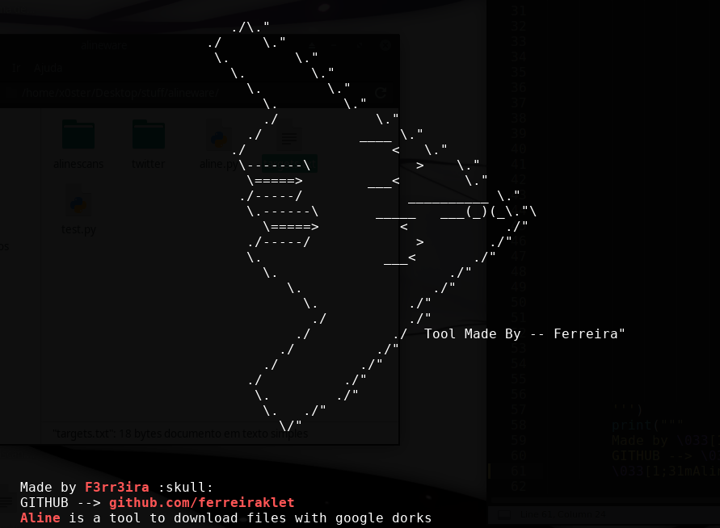

<h1 align="center">Aline</h1> <br>

<p align="center">
  <a href="#--usage">Usage</a> •
  <a href="#--installation--requirements">Installation</a>
</p>

<h3 align="center">Aline's main purpose is to make <a href="https://en.wikipedia.org/wiki/Google_hacking">Google Dorks</a> while, at the same time, be able to download the data recieved from those determined searches.</h3>

<hr>

<p align="center">
  
</p>

<hr>

<br>

## - Installation & Requirements:

> git clone https://github.com/ferreiraklet/aline.git <br>

> cd Aline/ <br>

> pip3 install -r requierements.txt <br>

<br>

## - Usage:

```markdown
# Pratical usage:
python3 aline.py -D "site:.com ext:txt" -o outputfile.txt -r 20 -s

# Help pannel:
  -h, --help            :: Show this help message and exit
  
  -d DOMAIN, --domain DOMAIN
                        :: Target's domain

  -f FILETYPE, --filetype FILETYPE
                        :: Filetype

  -F FILE, --file FILE  
                        :: Read a file and download containing links

  -D DORKS, --dorks DORKS
                        :: Dorks

  -o OUTPUT, --output OUTPUT
                        :: Output file

  -r RANGE, --range RANGE
                        :: Range, Default 50
  -s, -silent           :: Silent mode
```
<br>

<hr>


Made with ❤️ by [ferreira](https://github.com/ferreiraklet)
